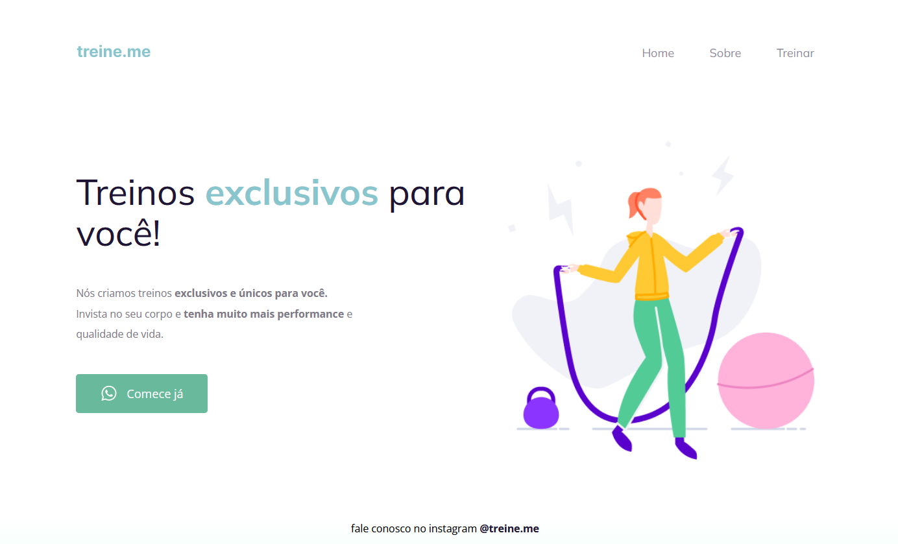

# Desafio: Rocket Landing Pages / Semântica e acessibilidade

Projeto construído a partir do Programa Explorer / Stage 02 / Corrigindo bugs(2).  
Foi disponibilizado um zip com o projeto pronto, porém sem as tags semânticas, nosso objetivo era adicionar essas tags para ajudar na acessibilidade.
 

link do desafio:  

## ⚙️ Tecnologias utilizadas

- HTML 
- CSS  
- Git e Github

## 🧾 Contato

Email: jonatankalmeidakk28@gmail.com  
WhatsApp: (49) 9 8435-6670

## 🤓 Considerações

Esse projeto foi muito importante para aprender a montar o corpo do projeto de forma correta, visando auxiliar na acessibilidade dos usuários.